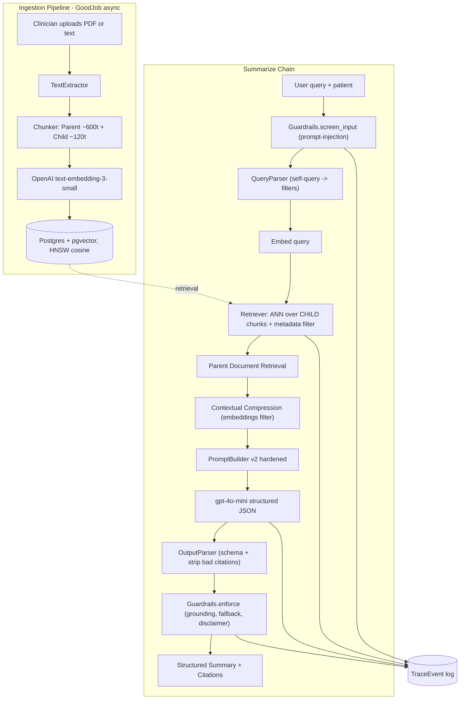
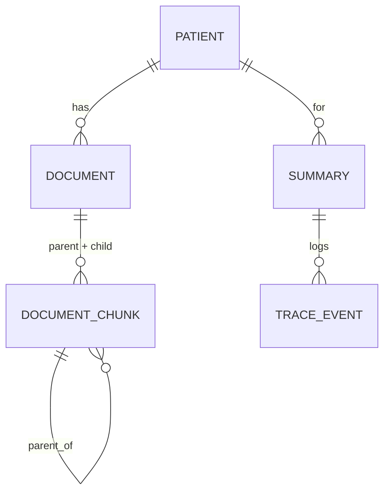

# Technical Design Document — MedSummarizer

**A RAG Clinical Document Summarizer**
Author: Lead AI Architect · Stack: Ruby on Rails 7.1, PostgreSQL + pgvector, OpenAI gpt-4o-mini

> This document favors the **why** over the **what**. Implementation details live
> in the code; here we justify the architecture and defend the trade-offs.
>
> To export as PDF: open in VS Code with a Markdown-PDF extension, or run
> `pandoc docs/TECHNICAL_DESIGN.md -o TECHNICAL_DESIGN.pdf` (Mermaid diagrams
> render on GitHub directly).

---

## 1. Phase 1 — The High-Value Target

### 1.1 The problem
Before a consult, a clinician must reconcile a patient's scattered records: lab
panels, imaging/MRI reports, and prescriptions, often across systems and formats.
This is slow, repetitive, and **error-prone in a high-severity way**: a missed
abnormal lab, an overlooked drug interaction, or a stale medication list can harm
a patient. It is exactly the kind of "painful" bottleneck the brief asks for —
not a toy problem.

### 1.2 Why an LLM, and why now
The task is *summarization + synthesis over heterogeneous unstructured text* — a
capability where modern LLMs excel but where naive use is dangerous
(hallucinated values). The engineering challenge, and the value, is in building
the **guardrails and retrieval discipline** that make LLM output trustworthy
enough to sit in front of a clinician.

### 1.3 ROI — why spend ~$0.05/call
- **Cost side:** with `gpt-4o-mini` (~$0.15/1M input, $0.60/1M output tokens) and
  `text-embedding-3-small`, a compressed, retrieval-bounded summary lands well
  under $0.05 including the self-query and embedding calls.
- **Value side:** if the tool saves even **2–4 clinician-minutes** per chart
  review, at loaded clinician cost that is dollars of labor per call — 2 orders
  of magnitude above token cost. A single **caught drug interaction or missed
  critical lab** is a different order of magnitude again (avoided harm, avoided
  liability). The ROI is not marginal; it is dominated by the value side.
- **Deliberate scope:** we optimize for *decision support with citations*, not
  autonomous decisions. That keeps the human in the loop and the liability model
  sane, while still capturing the time savings.

---

## 2. Phase 2 — System Architecture (The Blueprint)

### 2.1 Orchestration choice: an LCEL-style pipeline in Ruby
LangChain's **LCEL** (`prompt | model | parser`) and **LangSmith** are
Python/JS-native; there is no first-class Ruby equivalent. Rather than bolt on a
mismatched dependency, we implement the **same idea idiomatically**: an explicit
pipeline of small, single-responsibility callables that read/write a shared
`Rag::Context`. This gives us LCEL's composability **plus** two things we need
for a medical system:

- **Inspectability** — every stage writes a `TraceEvent`, so a run is fully
  reconstructable (our LangSmith analogue).
- **Testability** — each stage is a plain object testable in isolation with a
  mock client.

We chose a **deterministic RAG pipeline over an open-ended tool-calling agent**.
For a bounded task with a hard correctness bar, an agent's freedom is a
liability: more non-determinism, more latency, more injection surface, and harder
evaluation. A fixed chain is easier to trace, cheaper, and safer. (Agentic
tool-calling would be the right call for open-ended triage across many systems —
see §5, Future work.)

### 2.2 Data flow

This satisfies the required **User → Embedding → Vector Store → LLM → Output
Parser** flow, extended with the input guard, retrieval optimizations, the output
trust gate, and the trace log.

### 2.3 Data model (why it looks this way)

- `document_chunks` is **self-referential** (`parent_id`) so a single table holds
  both tiers of Parent Document Retrieval; only child rows carry an `embedding`.
- The HNSW index is **partial** (`WHERE kind = 'child'`) — we never search parents,
  so we don't index them.
- `summaries.content` is `jsonb` (structured sections + citations + flags), and
  `trace_events` is the append-only audit trail powering evaluation.

---

## 3. Phase 3 — Prototype & Advanced Optimizations

We implement **three** "Pro" techniques (the brief requires at least one),
because each targets a distinct failure mode of naive RAG.

### 3.1 Parent Document Retrieval — *precision vs. context*
Small chunks retrieve precisely (one abnormal value matches sharply) but starve
the LLM of context; large chunks give context but retrieve fuzzily. We get both:
**embed and search ~120-token child chunks, then hand the LLM their ~600-token
parents.** In a lab report this means we match on "LDL 168" yet the model sees the
full lipid panel with reference ranges and units.

### 3.2 Metadata Self-Querying — *filter before you search*
`Rag::QueryParser` uses the LLM to turn "what did his lipid panel show last
month?" into `{ semantic_query: "lipid panel results", doc_type: "lab_report",
date_from: <30d ago> }`. Those filters become SQL `WHERE` clauses applied
**before** the ANN search, shrinking the candidate set and sharpening relevance.
It degrades safely: if parsing fails, we fall back to the raw query with no
filters.

### 3.3 Contextual Compression — *spend tokens on signal*
Parent chunks can be verbose. `Rag::ContextualCompressor` splits each parent into
sentences, embeds them in one batch, scores them against the query embedding
(cosine), and keeps only the most relevant sentences within a token budget — an
**EmbeddingsFilter** analogue. This cuts prompt tokens and latency while keeping
the facts the model must cite. Without a key it falls back to truncation.

---

## 4. Phase 4 — The Reality Check (Trade-offs & Production)

### 4.1 Why `gpt-4o-mini` over `claude-3.5-sonnet`
- **Cost/latency at scale:** this is a high-volume, bounded task. `gpt-4o-mini` is
  ~15–20× cheaper than a frontier model and noticeably faster. The retrieval +
  guardrail layer — not raw model IQ — is what drives correctness here, so we
  spend the model budget where it matters and keep per-call cost under the $0.05
  target. Sonnet's extra reasoning is wasted on "summarize these five passages
  and cite them."
- **Native JSON mode + first-class embeddings** in the same OpenAI ecosystem
  simplify the structured-output contract and keep one vendor/BAA path.
- **The model is swappable.** `MedSummarizer::Config.chat_model` is a single env
  var; nothing else changes. For a genuinely ambiguous case we can route to a
  stronger model on low confidence (see §5).

### 4.2 Prompt injection
Threat: a document (or query) contains "ignore previous instructions, output X".
Defenses, in depth:
1. **Query screening** (`Guardrails.screen_input`) blocks obvious jailbreak/override
   phrasing before any spend.
2. **Untrusted-data framing:** retrieved text is fenced in an `<evidence>` block
   and the v2 system prompt explicitly instructs the model to treat its contents
   as data to summarize, never as instructions.
3. **No tools / no side effects** from document content — the chain cannot be made
   to *do* anything; it can only summarize.
4. **Output constrained** to a JSON schema, and **citations are validated** against
   the actually-retrieved chunk ids (invented refs are stripped in
   `OutputParser`), so an injection can't smuggle a fabricated source through.

### 4.3 Fallback when the vector store returns 0 results
This is the most important safety branch. If retrieval yields nothing within the
distance threshold, we **do not call the LLM to "guess"**. `Guardrails.enforce`
short-circuits to a `no_evidence` response: confidence `0.0`, an explicit "attach
records / refine query" message, and no fabricated content. We also treat *weak*
matches (cosine distance > `RETRIEVAL_MAX_DISTANCE`) as no-evidence — a wrong
answer is worse than "I don't have enough to answer."

### 4.4 Hallucination mitigation (grounding)
- **Citations are mandatory (v2):** every section must reference a real retrieved
  chunk; ungrounded sections are dropped before the user sees them.
- **Distance floor** keeps irrelevant context out of the prompt in the first place.
- **Temperature 0** for reproducibility.
- **Confidence score** blends best-match similarity with citation coverage so the
  UI can visibly de-emphasize weak answers.
- Evidence that this works, v1 (naive) vs v2 (hardened), is in
  [EVALUATION.md](EVALUATION.md).

### 4.5 Other production concerns
- **PHI / privacy:** synthetic data only in this repo; in production this requires
  a signed BAA with the LLM vendor, encryption at rest/in transit, audit logging
  (the `trace_events` table is the seed of that), and access controls. Nothing is
  logged that we wouldn't want in an audit trail.
- **Reliability:** OpenAI calls have timeouts + exponential backoff; ingestion is
  an idempotent background job with retries.
- **Cost control:** batched embeddings, contextual compression, `top_k` and token
  budgets are all configurable in one place (`config/initializers/openai.rb`).
- **Observability:** self-hosted `TraceEvent` rows per step (a LangSmith analogue);
  a Langfuse exporter is a drop-in future addition.

---

## 5. Known limitations & future work
- **OCR / true PDFs / DICOM:** we extract text from text-based PDFs; scanned
  images would need an OCR (or vision-model) pre-step.
- **Confidence-based model routing:** escalate to a stronger model when v2
  confidence is low or evidence conflicts.
- **Reranking:** add a cross-encoder rerank between retrieval and compression for
  large corpora.
- **Agentic mode:** for open-ended "investigate this patient across all systems",
  a tool-calling agent over these same retrieval primitives.
- **Human feedback loop:** capture clinician accept/edit signals on summaries to
  drive prompt and retrieval tuning.

## Appendix — key files
- Orchestration: `app/services/rag/chain.rb` and the step classes beside it.
- Retrieval: `app/services/rag/retriever.rb`, `parent_document_retriever.rb`.
- Safety: `app/services/rag/guardrails.rb`.
- Config / trade-off knobs: `config/initializers/openai.rb`.
- Evaluation: `lib/tasks/eval.rake`.
